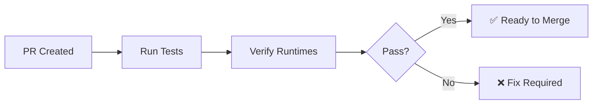
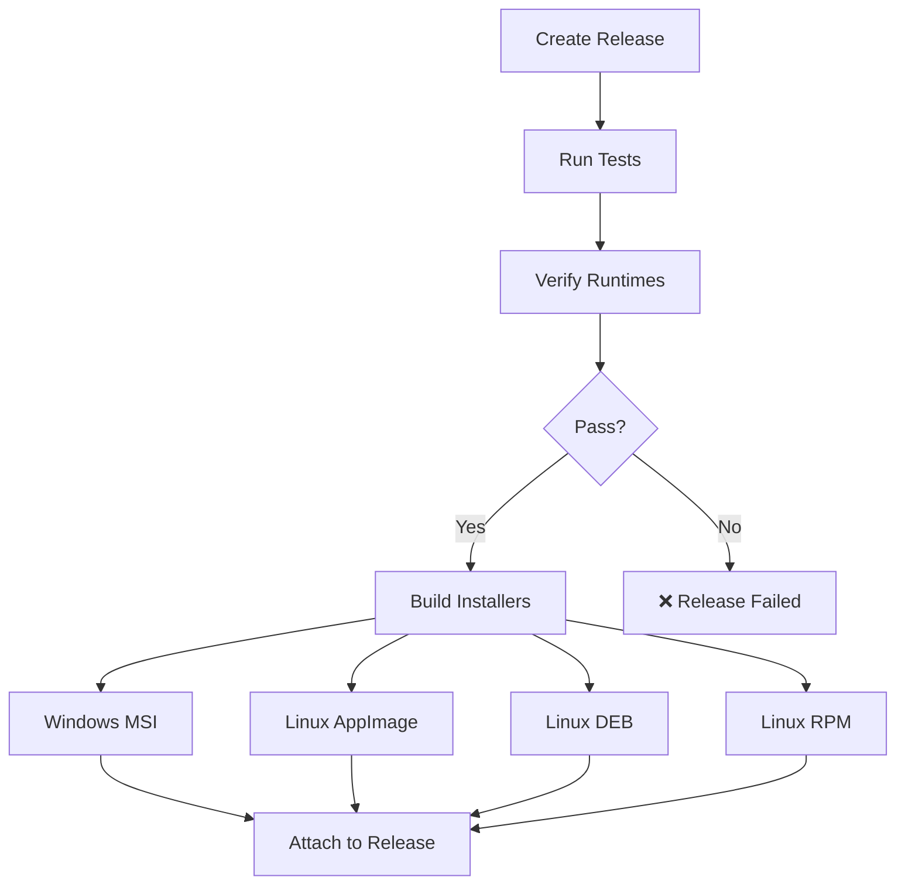

# GitHub Actions CI/CD

This directory contains automated workflows for testing, building, and releasing Zylance.

## Workflows

### 🧪 CI (`ci.yml`)

**Triggers:** Push to `main`/`develop`, Pull Requests

**What it does:**

1. **Runs all tests** - Core, Desktop, Vault.Local, Vault.Remote
2. **Verifies multi-runtime builds** - Tests that libraries build for:
    - Windows x64 (`win-x64`)
    - Linux x64 (`linux-x64`)
    - macOS x64 (`osx-x64`)
    - macOS ARM64 (`osx-arm64`)
    - Browser WebAssembly (`browser-wasm`)
3. **Publishes Desktop** for each native platform
4. **Uploads test results** and build artifacts

**Status badges:**

```markdown

```

### 📦 Build Installers (`build-installers.yml`)

**Triggers:**

- Release creation
- Manual dispatch (Actions tab)

**What it does:**

1. **Runs tests** - Ensures all tests pass before building installers
2. **Verifies runtimes** - Confirms win-x64, linux-x64, and browser-wasm builds work
3. **Builds installers** (in parallel):
    - Windows MSI
    - Linux AppImage
    - Linux DEB
    - Linux RPM
4. **Uploads to release** - Automatically attaches installers to GitHub release

**Manual trigger:**

1. Go to Actions → Build Installers
2. Click "Run workflow"
3. Enter version number (e.g., `1.0.0`)
4. Download artifacts when complete

## Local Testing

### Run Tests

```powershell
# All tests
dotnet test

# Specific project
dotnet test Zylance.Core.Tests
```

### Verify Runtime Builds

```powershell
# Automated verification script
.\Scripts\verify-runtimes.ps1

# Manual verification
dotnet build Zylance.Core -r browser-wasm
dotnet build Zylance.Core -r win-x64
dotnet build Zylance.Core -r linux-x64
```

### Build Installers Locally

```powershell
# Windows MSI
.\Zylance.Installers\windows\build.ps1 -Version "1.0.0"

# Linux (requires Linux or WSL)
cd Zylance.Installers/linux
APP_VERSION="1.0.0" bash build-all.sh
```

## CI/CD Flow

### On Pull Request



1. All tests must pass
2. All runtimes must build successfully
3. PR can be merged when checks pass

### On Release



1. Tests run first
2. Runtime builds verified
3. If pass, installers build in parallel
4. Installers automatically attach to release

## Test Requirements

All test projects use xUnit and must:

- Have proper test naming conventions
- Clean up resources in `Dispose()`
- Use `[Fact]` for simple tests
- Use `[Theory]` with `[InlineData]` for parameterized tests

## Runtime Support

The CI verifies that Core, Contract, and UI libraries build for all these runtimes:

| Runtime        | Purpose             | CI Testing             |
|----------------|---------------------|------------------------|
| `win-x64`      | Windows Desktop     | ✅ Full build + publish |
| `linux-x64`    | Linux Desktop       | ✅ Full build + publish |
| `osx-x64`      | macOS Intel         | ✅ Build verification   |
| `osx-arm64`    | macOS Apple Silicon | ✅ Build verification   |
| `browser-wasm` | Web Client (future) | ✅ Build verification   |

**Why test browser-wasm?** Ensures libraries remain compatible with the most restrictive runtime for future web client
development.

## Troubleshooting

### Tests fail in CI but pass locally

- Ensure you've committed all necessary files
- Check for hardcoded paths or environment-specific code
- Review test output in GitHub Actions logs

### Runtime build fails

- Run `.\Scripts\verify-runtimes.ps1` locally
- Check if you need to install workloads:
  ```bash
  dotnet workload install wasm-tools
  ```
- Verify `RuntimeIdentifier` is not hardcoded in library projects

### Installer build fails

- Check test and runtime verification passed first
- Review build logs for specific errors
- Test installer scripts locally before pushing

### WiX errors on Windows

- Ensure WiX is installed: `dotnet tool install --global wix`
- Check Product.wxs is valid XML
- Verify version follows MSI format (no pre-release labels)

## Adding New Tests

1. Create test class in appropriate test project
2. Add xUnit `[Fact]` or `[Theory]` attributes
3. Test locally: `dotnet test`
4. Push - CI will automatically run new tests

## Adding New Runtimes

To add support for a new runtime (e.g., `linux-arm64`):

1. **Update CI workflow** (`.github/workflows/ci.yml`):
   ```yaml
   - runtime: linux-arm64
     os: ubuntu-latest
     name: Linux ARM64
   ```

2. **Update verification script** (`Scripts/verify-runtimes.ps1`):
   ```powershell
   @{ Name = "Linux ARM64"; RID = "linux-arm64"; Supported = $IsLinux }
   ```

3. **Test locally** if possible
4. Push and verify CI passes

## Release Process

### Automatic (Recommended)

1. Create and push a tag:
   ```bash
   git tag v1.0.0
   git push origin v1.0.0
   ```

2. Create release on GitHub from the tag

3. Installers build automatically and attach to release

### Manual

1. Go to Actions → Build Installers
2. Click "Run workflow"
3. Enter version: `1.0.0`
4. Download artifacts when complete
5. Manually create release and upload installers

## Best Practices

✅ **Always run tests locally before pushing**

```powershell
dotnet test
```

✅ **Verify runtimes before major changes**

```powershell
.\Scripts\verify-runtimes.ps1
```

✅ **Use semantic versioning**

- Format: `MAJOR.MINOR.PATCH`
- Example: `1.0.0`, `1.2.3`, `2.0.0`
- ❌ Don't use: `v1.0.0`, `1.0.0-beta` (in release tags)

✅ **Let CI do the work**

- Tests run automatically on PR
- Installers build automatically on release
- No manual building for releases

## Status Checks

All PRs must pass these checks:

- ✅ All tests passing
- ✅ All runtime builds successful
- ✅ Code compiles without warnings (Release mode)

## Questions?

See the main project README or check workflow logs in the Actions tab.
